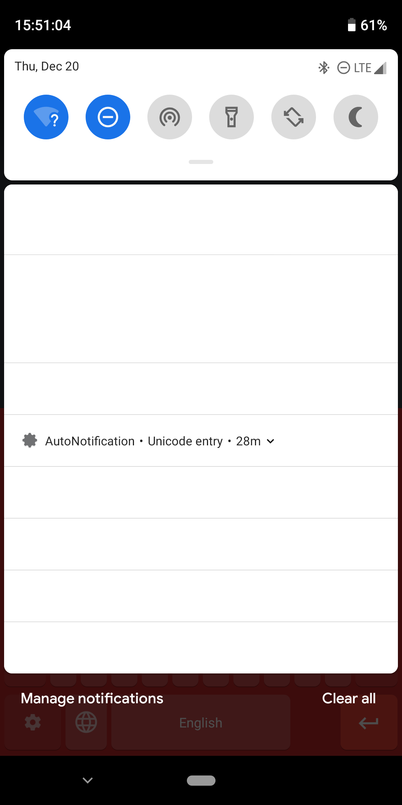
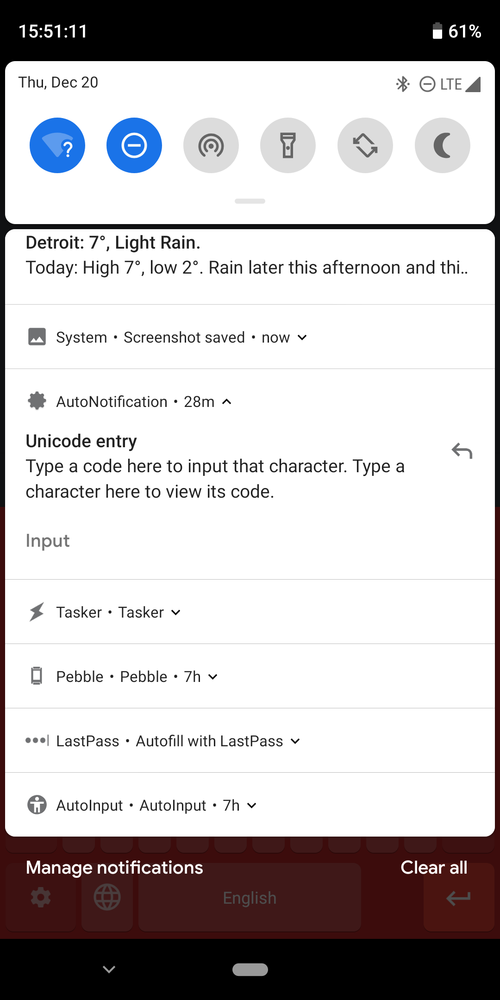
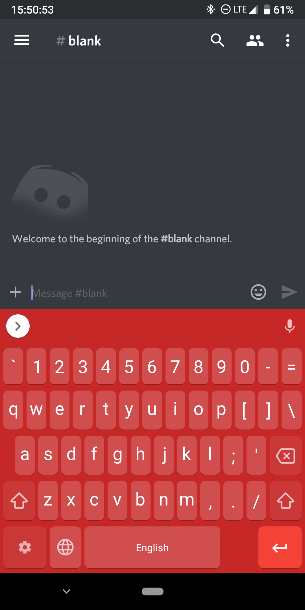
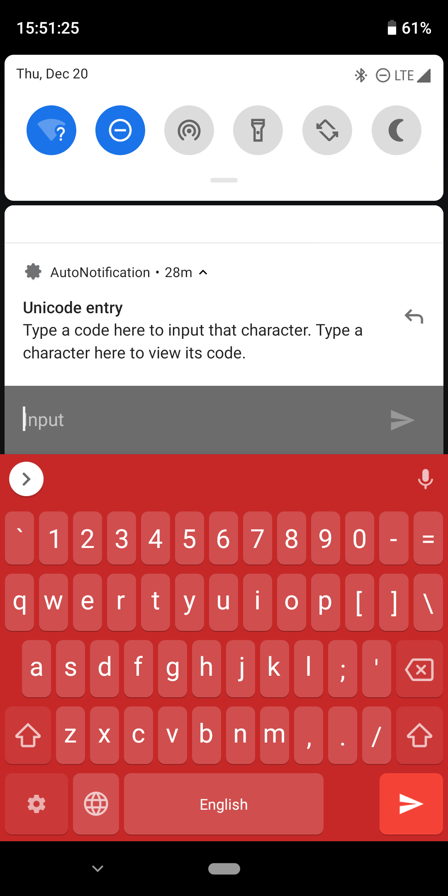
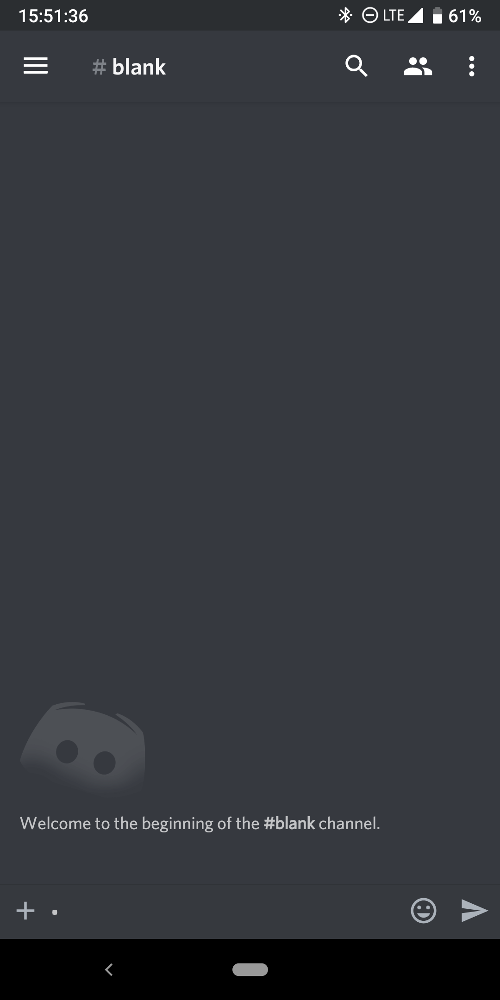
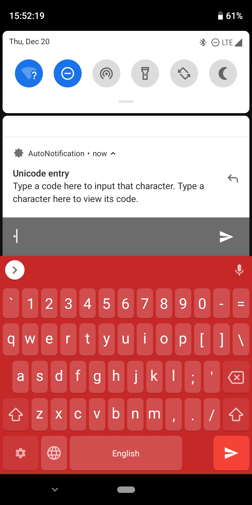
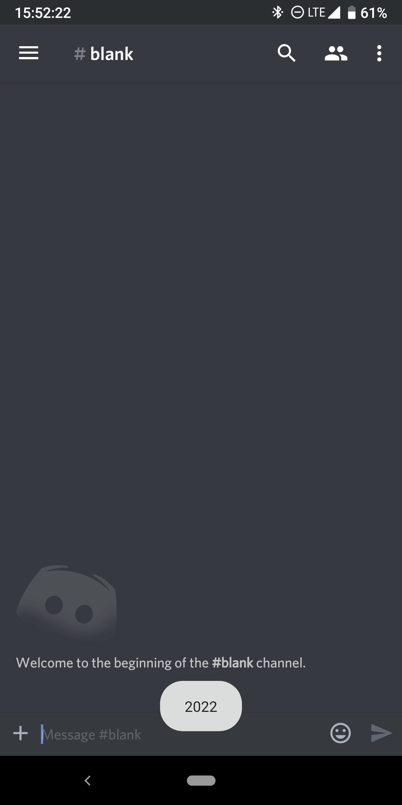

# Unicode entry notification
This project creates a permanent notification with which you can enter any Unicode character by its hexadecimal codepoint, or view the codepoint of any character.

# Plugins needed
This project requires [AutoNotification](https://play.google.com/store/apps/details?id=com.joaomgcd.autonotification) and [AutoInput](https://play.google.com/store/apps/details?id=com.joaomgcd.autoinput). Additionally, AutoInput requires its accessibility service be enabled.

# How to use
The project will automatically create a notification of the lowest importance (won't create an icon in the status bar).

Once you select the text field you want the character entered into, expand the notification to reveal the Input button.

Tap the Input button to show a text field. In there, enter the codepoint of the character you wish to type. If there are multiple codepoints, separate them with spaces.

After you enter your codepoints, voila! The character you referenced will appear in the text field as if by magic!

## Viewing codepoints
If you already have the character and wish to know what its codepoint is, simply enter the character into the field and submit. You will be shown the point in a message at the bottom.

